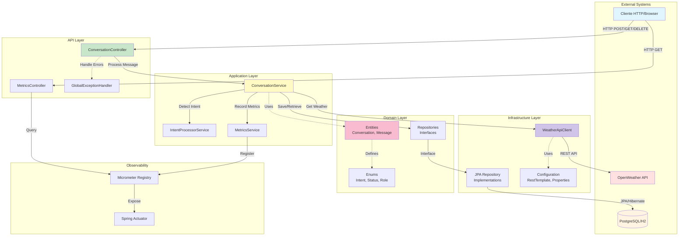
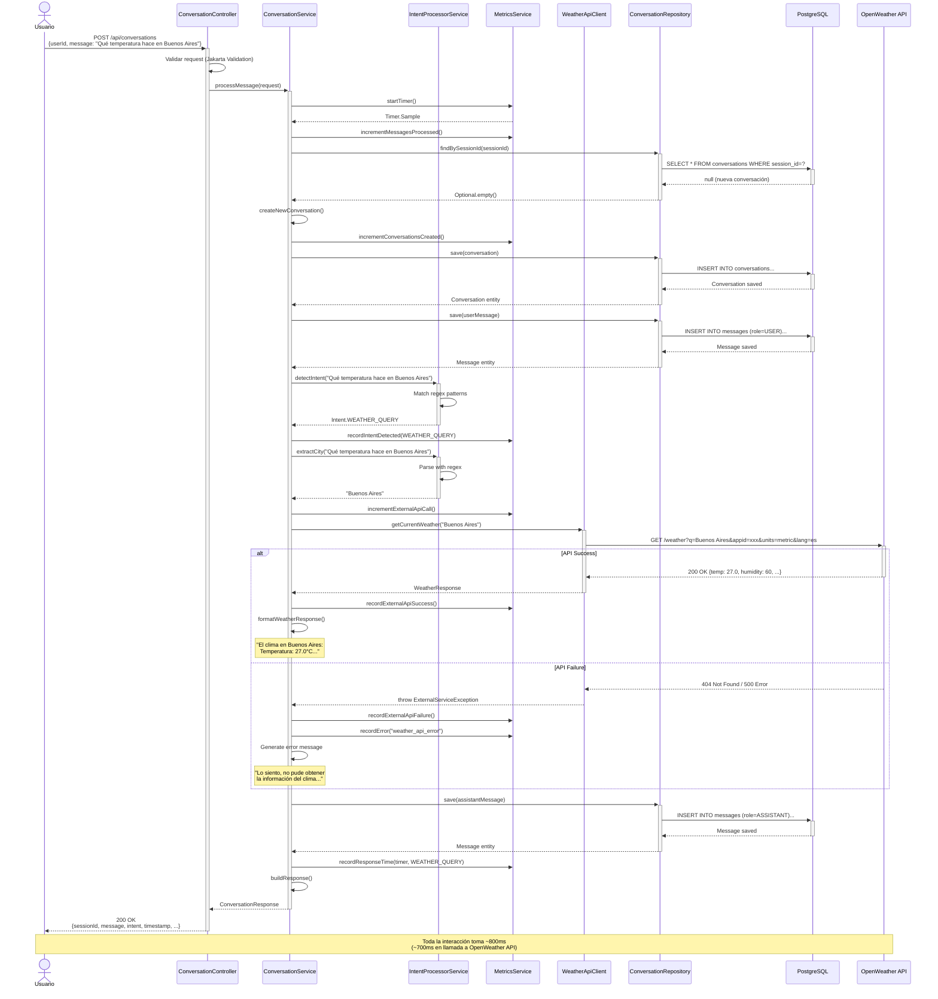

# Arquitectura del Sistema Conversacional

## Visión General

Este microservicio implementa un asistente virtual conversacional siguiendo los principios de **Arquitectura Hexagonal** (Ports & Adapters), lo que permite:
- Separación clara de responsabilidades
- Fácil testeo mediante mocks
- Flexibilidad para cambiar implementaciones
- Preparación para evolución futura

---

## Diagrama de Componentes


---

## Capas y Responsabilidades

### 1. API Layer (Interfaz HTTP)
**Responsabilidad:** Exponer endpoints REST y manejar errores HTTP.

**Componentes:**
- `ConversationController`: Endpoints para conversaciones
    - `POST /api/conversations`: Enviar mensaje
    - `GET /api/conversations/{sessionId}`: Obtener historial
    - `DELETE /api/conversations/{sessionId}`: Finalizar conversación
- `MetricsController`: Endpoint de métricas custom
    - `GET /api/metrics/summary`: Resumen de métricas
- `GlobalExceptionHandler`: Manejo centralizado de errores
    - Convierte excepciones en respuestas HTTP apropiadas
    - Estandariza formato de errores

**Tecnologías:**
- Spring Web MVC
- Jakarta Validation
- Swagger/OpenAPI (Springdoc)

---

### 2. Application Layer (Lógica de Negocio)
**Responsabilidad:** Orquestar el flujo de procesamiento de conversaciones.

**Componentes:**
- `ConversationService`: Orquestador principal
    - Procesa mensajes de usuarios
    - Coordina detección de intenciones
    - Maneja persistencia
    - Integra con servicios externos
- `IntentProcessorService`: Motor de intenciones
    - Detecta intención del mensaje (regex-based)
    - Extrae entidades (ej: nombres de ciudades)
    - Configurable y extensible
- `MetricsService`: Registro de métricas
    - Counters, Gauges, Timers
    - Integración con Micrometer

**Patrón:** Service Layer - toda la lógica de negocio aquí.

---

### 3. Domain Layer (Modelo de Negocio)
**Responsabilidad:** Definir el modelo de dominio y contratos de persistencia.

**Componentes:**
- **Entities (Entidades JPA):**
    - `Conversation`: Representa una conversación
        - sessionId, userId, status, timestamps
        - Relación OneToMany con Message
    - `Message`: Representa un mensaje
        - role (USER/ASSISTANT), content, intent
        - Relación ManyToOne con Conversation
- **Enums:**
    - `Intent`: GREETING, WEATHER_QUERY, HELP, FAREWELL, UNKNOWN
    - `ConversationStatus`: ACTIVE, COMPLETED, ABANDONED, ERROR
    - `MessageRole`: USER, ASSISTANT
- **Repositories (Interfaces):**
    - `ConversationRepository`: Queries de conversaciones
    - `MessageRepository`: Queries de mensajes

**Patrón:** Domain-Driven Design (DDD) - el dominio es independiente de la infraestructura.

---

### 4. Infrastructure Layer (Adaptadores Externos)
**Responsabilidad:** Implementar integraciones con sistemas externos.

**Componentes:**
- **Persistence:**
    - JPA Repository Implementations (Spring Data JPA)
    - Hibernate como ORM
    - Soporte para H2 (dev) y PostgreSQL (prod)
- **External Services:**
    - `WeatherApiClient`: Cliente HTTP para OpenWeather API
        - RestTemplate configurado
        - Manejo de timeouts y errores
    - `ExternalServiceException`: Excepción custom para errores externos
- **Configuration:**
    - `RestClientConfig`: Bean de RestTemplate
    - `WeatherApiProperties`: Configuración type-safe
    - Profiles de Spring (dev, prod, test)

**Patrón:** Adapter Pattern - infraestructura intercambiable.

---

### 5. Observability (Monitoreo)
**Responsabilidad:** Exponer métricas y health checks.

**Componentes:**
- **Spring Boot Actuator:**
    - `/actuator/health`: Estado del servicio
    - `/actuator/metrics`: Métricas estándar y custom
    - `/actuator/info`: Información de la aplicación
- **Micrometer:**
    - Registry de métricas
    - Soporte para múltiples backends (Prometheus, Datadog, etc.)
    - Métricas custom implementadas en MetricsService

---

## Flujo de Datos

### Caso 1: Procesamiento de Mensaje
```
1. Cliente → POST /api/conversations
2. ConversationController → Valida request (Jakarta Validation)
3. ConversationController → ConversationService.processMessage()
4. ConversationService → IntentProcessorService.detectIntent()
5. ConversationService → (Si WEATHER_QUERY) WeatherApiClient.getCurrentWeather()
6. WeatherApiClient → OpenWeather API (HTTP GET)
7. ConversationService → ConversationRepository.save()
8. ConversationService → MetricsService.recordMetrics()
9. ConversationController → Retorna ConversationResponse al cliente
```

### Caso 2: Consulta de Métricas
```
1. Cliente → GET /api/metrics/summary
2. MetricsController → MeterRegistry.find()
3. MetricsController → Agrega y formatea métricas
4. MetricsController → Retorna JSON con métricas
```

---

## Decisiones de Diseño Clave

### 1. Arquitectura Hexagonal
**Decisión:** Separar el dominio de la infraestructura.

**Justificación:**
- Facilita testing (mocks de infraestructura)
- Permite cambiar base de datos sin afectar lógica de negocio
- Preparado para microservicios distribuidos
- Código más mantenible y escalable

**Trade-off:** Mayor cantidad de capas, pero beneficio a largo plazo.

---

### 2. DTOs Separados de Entidades
**Decisión:** No exponer entidades JPA directamente en la API.

**Justificación:**
- Evita lazy loading exceptions
- Control total sobre qué campos se exponen
- Versionado independiente de API y modelo de datos
- Seguridad: no exponer campos internos

**Alternativa descartada:** Exponer entidades directamente (más simple pero menos flexible).

---

### 3. Detección de Intenciones con Regex
**Decisión:** Usar patrones regex en lugar de ML/NLP.

**Justificación:**
- **Para el alcance actual:** suficiente y predecible
- Sin dependencias externas pesadas
- Latencia mínima (<1ms)
- Fácil de debuggear y mantener

**Evolución futura:** Integrar con servicio NLP (ej: Google DialogFlow, Amazon Lex) cuando la complejidad lo justifique.

---

### 4. RestTemplate en lugar de WebClient
**Decisión:** Usar RestTemplate (síncrono) para llamadas a OpenWeather API.

**Justificación:**
- Suficiente para el volumen actual
- Código más simple y directo
- OpenWeather API responde rápido (<500ms)

**Evolución futura:** Migrar a WebClient (reactivo) si se requiere mayor throughput.

---

### 5. Base de Datos Relacional (PostgreSQL)
**Decisión:** Usar PostgreSQL en lugar de NoSQL.

**Justificación:**
- Modelo de datos estructurado (relación Conversation-Message)
- ACID garantiza consistencia
- Queries complejas más simples (SQL vs. NoSQL queries)
- Madurez y tooling del ecosistema

**Alternativa descartada:** MongoDB (útil si el esquema fuera muy variable).

---

### 6. Métricas con Micrometer
**Decisión:** Usar Micrometer en lugar de implementación custom.

**Justificación:**
- Estándar de facto en Spring Boot
- Integración nativa con múltiples backends
- Performance optimizado
- Soporte de comunidad

---

## Patrones de Diseño Aplicados

### 1. Repository Pattern
**Ubicación:** `ConversationRepository`, `MessageRepository`

**Beneficio:** Abstrae la persistencia, facilita testing.

---

### 2. Service Layer Pattern
**Ubicación:** `ConversationService`, `IntentProcessorService`

**Beneficio:** Centraliza lógica de negocio, reutilizable.

---

### 3. Dependency Injection
**Ubicación:** Toda la aplicación (Spring)

**Beneficio:** Bajo acoplamiento, testeable con mocks.

---

### 4. Builder Pattern
**Ubicación:** DTOs y Entities (Lombok @Builder)

**Beneficio:** Construcción fluida de objetos inmutables.

---

### 5. Exception Translation
**Ubicación:** `GlobalExceptionHandler`

**Beneficio:** Excepciones técnicas → Respuestas HTTP amigables.

---

## Escalabilidad

### Escalamiento Horizontal
**Preparación actual:**
- Stateless (sesión en DB, no en memoria)
- Múltiples instancias pueden correr simultáneamente
- Load balancer distribuye tráfico

**Estrategia:**
```
[Load Balancer]
    ├── [Instance 1] → [PostgreSQL]
    ├── [Instance 2] → [PostgreSQL]
    └── [Instance 3] → [PostgreSQL]
```

### Escalamiento Vertical
**Límites actuales:**
- JVM: 2GB RAM recomendado por instancia
- CPU: 2 cores recomendado
- Throughput estimado: ~1000 req/s por instancia

---

## Seguridad (Estado Actual)

### Implementado:
- Variables de entorno para secrets
- Validación de inputs (Jakarta Validation)
- Manejo de errores sin exponer stack traces
- Logging sin información sensible

### Pendiente (Roadmap):
- Autenticación (JWT)
- Rate limiting
- HTTPS obligatorio
- CORS configurado

---

## Tecnologías y Versiones

| Componente | Tecnología | Versión |
|-----------|------------|---------|
| Lenguaje | Java | 17 |
| Framework | Spring Boot | 3.4.12 |
| Build | Maven | 3.9+ |
| Base de Datos (Prod) | PostgreSQL | 15+ |
| Base de Datos (Dev) | H2 | 2.3.232 |
| ORM | Hibernate | 6.6.36 |
| API Docs | Springdoc OpenAPI | 2.7.0 |
| Métricas | Micrometer | 1.14.13 |
| Testing | JUnit 5 + Mockito | 5.11.4 |
| Logging | Logback | 1.5.21 |

---

## Próximos Pasos Recomendados

### Corto Plazo (1-2 semanas)
1. Implementar autenticación JWT
2. Agregar caché para OpenWeather API (Redis)
3. Circuit breaker para resiliencia (Resilience4j)

### Mediano Plazo (1-2 meses)
1. Migrar detección de intenciones a servicio NLP
2. Implementar WebSocket para conversaciones en tiempo real
3. Dashboard de métricas con Grafana

### Largo Plazo (3-6 meses)
1. Arquitectura de microservicios distribuidos
2. Event-driven con Kafka/RabbitMQ
3. Deployment en Kubernetes


---

## Diagrama de Secuencia - Caso de Uso Principal

### Escenario: Usuario Consulta el Clima


---

### Flujo Detallado

#### 1. Recepción de Request (API Layer)
```
Usuario → Controller
- Validación automática con Jakarta Validation
- @NotBlank, @Size verificados
- Si falla: retorna 400 Bad Request
```

#### 2. Inicialización (Application Layer)
```
Controller → ConversationService
- Inicia timer de performance
- Incrementa contador de mensajes procesados
```

#### 3. Gestión de Conversación (Domain + Infrastructure)
```
ConversationService → Repository → Database
- Busca conversación existente por sessionId
- Si no existe: crea nueva (UUID generado)
- Incrementa contador de conversaciones creadas
- Guarda mensaje del usuario (role=USER)
```

#### 4. Procesamiento de Intención (Application Layer)
```
ConversationService → IntentProcessorService
- Detecta intención con regex patterns
- Extrae entidades (ciudad en este caso)
- Registra métrica de intención detectada
```

#### 5. Integración Externa (Infrastructure Layer)
```
ConversationService → WeatherApiClient → OpenWeather API
- Construye URL con UriComponentsBuilder
- Configura timeout (5s conexión, 10s lectura)
- Parsea respuesta JSON a WeatherResponse DTO
- Maneja errores con try-catch
```

#### 6. Registro de Métricas (Observability)
```
ConversationService → MetricsService
- Incrementa contador de llamadas a API
- Registra éxito o fallo
- Si fallo: también incrementa contador de errores
```

#### 7. Generación de Respuesta (Application Layer)
```
ConversationService
- Formatea respuesta del clima (si éxito)
- O genera mensaje de error amigable (si fallo)
- Guarda mensaje del asistente (role=ASSISTANT)
```

#### 8. Finalización (API Layer)
```
ConversationService → Controller → Usuario
- Registra tiempo total de respuesta
- Construye ConversationResponse DTO
- Retorna 200 OK con JSON
```

---

### Tiempos Estimados por Componente

| Componente | Tiempo Estimado | Observación |
|-----------|-----------------|-------------|
| Validación de request | <1ms | Jakarta Validation |
| Detección de intención | <1ms | Regex matching |
| Extracción de ciudad | <1ms | Regex parsing |
| Query a PostgreSQL | 5-20ms | Depende de índices |
| Llamada a OpenWeather API | 300-1000ms | **Cuello de botella** |
| Formateo de respuesta | <1ms | String operations |
| Insert a PostgreSQL | 5-15ms | Transacción |
| **Total (caso exitoso)** | **~800ms** | Dominado por API externa |

---

### Puntos de Fallo y Resiliencia

#### 1. OpenWeather API No Disponible
**Síntoma:** Timeout o HTTP 5xx

**Manejo Actual:**
- Try-catch captura la excepción
- Registra métrica de fallo
- Retorna mensaje amigable al usuario

**Mejora Futura:**
- Circuit breaker (Resilience4j)
- Caché de respuestas recientes (Redis)
- Fallback a proveedor alternativo

---

#### 2. Base de Datos No Disponible
**Síntoma:** Connection timeout

**Manejo Actual:**
- HikariCP reintenta conexión
- Si falla: GlobalExceptionHandler captura
- Retorna 500 Internal Server Error

**Mejora Futura:**
- Read replicas para queries
- Connection pool tuning
- Health check proactivo

---

#### 3. Alta Carga Simultánea
**Síntoma:** Latencia aumenta

**Manejo Actual:**
- Spring Boot maneja threads (Tomcat pool)
- PostgreSQL maneja conexiones (HikariCP)

**Mejora Futura:**
- Rate limiting por usuario
- Auto-scaling horizontal
- Queue para procesamiento asíncrono

---

### Casos de Uso Adicionales

#### Caso 2: Finalizar Conversación
```
Usuario → DELETE /api/conversations/{sessionId}
    → ConversationService.endConversation()
        → Busca conversación en DB
        → Actualiza status a COMPLETED
        → Registra endedAt timestamp
        → Decrementa conversaciones activas
    → Retorna 204 No Content
```

#### Caso 3: Consultar Historial
```
Usuario → GET /api/conversations/{sessionId}
    → ConversationService.getConversationHistoryDto()
        → Busca conversación en DB
        → Carga mensajes (eager fetch)
        → Convierte a DTOs
    → Retorna 200 OK con lista de mensajes
```

---

## Conclusión

Este diseño de arquitectura proporciona:
- Separación clara de responsabilidades
- Fácil testeo y mantenimiento
- Extensibilidad para nuevas intenciones
- Observabilidad completa
- Preparado para escalar

**Trade-offs aceptados:**
- Latencia por llamada a API externa (inevitable)
- Complejidad de capas vs. beneficio a largo plazo
