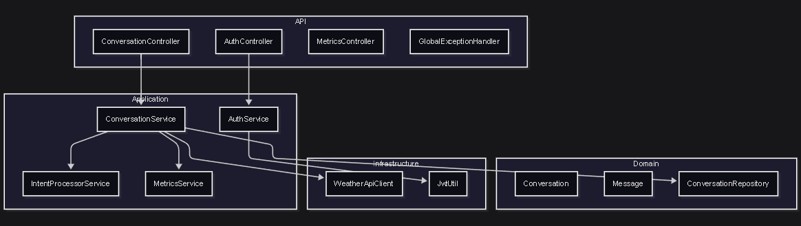
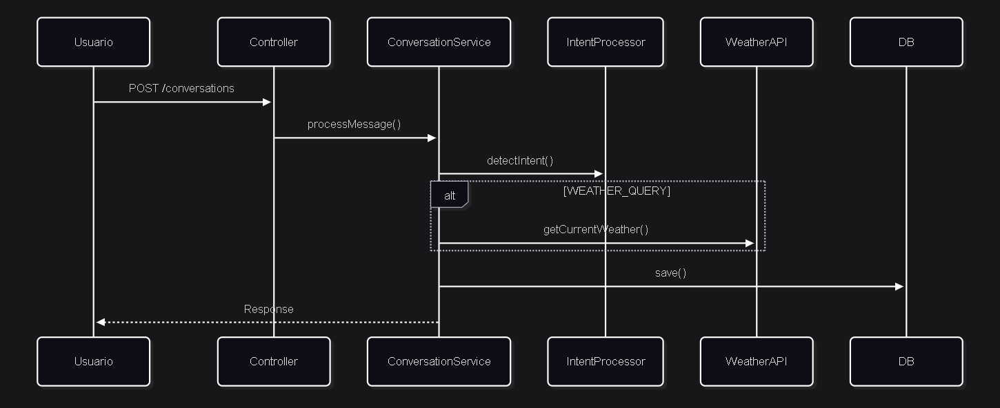

# Conversational Assistant

Microservicio Java de asistente virtual conversacional con integración a OpenWeather API.

## Stack Tecnológico

- Java 17 + Spring Boot 3.4
- H2 (desarrollo) / PostgreSQL (producción)
- OpenWeather API para consultas de clima
- Micrometer + Actuator para métricas
- JWT para autenticación

## Requisitos

- Java 17+
- Maven 3.9+
- API Key de OpenWeather (gratuita): https://openweathermap.org/api

## Ejecución (desarrollo)

**1. Clonar el proyecto**
```bash
git clone https://github.com/waegarcia/conversational-assistant.git
cd conversational-assistant
```

**2. Configurar variables de entorno**

Linux/Mac:
```bash
export WEATHER_API_KEY=<tu_api_key_OpenWeather_API>
export JWT_SECRET=<clave_minimo_32_caracteres>
export AUTH_USERNAME=admin
export AUTH_PASSWORD=password123
```

Windows PowerShell:
```powershell
$env:WEATHER_API_KEY="<tu_api_key_OpenWeather_API>"
$env:JWT_SECRET="<clave_minimo_32_caracteres>"
$env:AUTH_USERNAME="admin"
$env:AUTH_PASSWORD="password123"
```

> Otra opción es crear un archivo .env local con estos datos.
> En desarrollo se usa una DB H2 en memoria, no es necesario configurar variables de base de datos.

**3. Ejecutar**
```bash
mvn spring-boot:run
```

**4. Verificar**
- Health check: http://localhost:8080/actuator/health → debe retornar `{"status":"UP"}`
- Swagger UI: http://localhost:8080/swagger-ui/index.html
- H2 Console: http://localhost:8080/h2-console (JDBC: `jdbc:h2:mem:assistant_db`, user: `sa`, pass: (dejar vacío) )

## API Endpoints

| Método | Endpoint | Descripción |
|--------|----------|-------------|
| POST | `/api/conversations` | Enviar mensaje al asistente |
| GET | `/api/conversations/{sessionId}` | Obtener historial de conversación |
| DELETE | `/api/conversations/{sessionId}` | Finalizar conversación |
| POST | `/api/auth/login` | Autenticación JWT |
| GET | `/api/metrics/summary` | Métricas del sistema |

**Credenciales desarrollo:** `admin` / `password123` (para obtener token JWT)

### Ejemplo de uso

```bash
# 1. Obtener token JWT
curl -X POST http://localhost:8080/api/auth/login \
  -H "Content-Type: application/json" \
  -d '{"username": "admin", "password": "password123"}'
# Respuesta: {"token": "eyJhbGciOiJIUzI1NiJ9..."}

# 2. Iniciar conversación (utilizar token JWT y guardar el sessionId de la respuesta)
curl -X POST http://localhost:8080/api/conversations \
  -H "Content-Type: application/json" \
  -H "Authorization: Bearer <token>" \
  -d '{"userId": "user1", "message": "Hola"}'
# Respuesta: {"sessionId": "abc-123", "message": "¡Hola!...", "intent": "GREETING", ...}

# 3. Continuar conversación (usar el mismo sessionId, se pueden hacer múltiples consultas a distintas ciudades)
curl -X POST http://localhost:8080/api/conversations \
  -H "Content-Type: application/json" \
  -H "Authorization: Bearer <token>" \
  -d '{"sessionId": "abc-123", "userId": "user1", "message": "Clima en Buenos Aires"}'
# Respuesta: {"sessionId": "abc-123", "message": "El clima en Buenos Aires...", "intent": "WEATHER_QUERY", ...}

# 4. Finalizar conversación (cuando se desee terminar)
curl -X DELETE http://localhost:8080/api/conversations/abc-123 \
  -H "Authorization: Bearer <token>"
# Respuesta: 204 No Content
```

## Intenciones soportadas

- **GREETING**: "Hola", "Buenos días" → Saludo
- **WEATHER_QUERY**: "Clima en Madrid" → Consulta OpenWeather API
- **HELP**: "Ayuda" → Instrucciones de uso
- **FAREWELL**: "Chau", "Adiós" → Despedida
- **UNKNOWN**: Cualquier otra cosa → Mensaje de ayuda

## Diagramas

### Arquitectura


### Secuencia


## Tests

```bash
mvn test
```

- 4 clases de test
- Cobertura de casos principales y manejo de errores

## Observabilidad

Métricas disponibles en `/api/metrics/summary`:
| Métrica | Descripción | Relevancia |
|---------|-------------|------------|
| `conversations.created` | Total de conversaciones | Mide adopción del servicio |
| `messages.processed` | Total de mensajes | Volumen de uso, dimensionar infra |
| `intents.detected` | Por tipo de intención | Identifica funcionalidades más usadas |
| `external.api.calls` | Llamadas a API externa | Monitorea dependencias externas |
| `response.time` | Tiempo por intención | UX crítica en chat, detectar cuellos de botella |

## Decisiones de diseño

1. **Regex para detección de intenciones**: Simple, predecible y sin dependencias externas. Suficiente para 5 intenciones. Para casos más complejos se podría integrar con DialogFlow o similar.

2. **RestTemplate vs WebClient**: RestTemplate es suficiente para el caso de uso actual y resulta en código más simple.

3. **PostgreSQL**: Modelo relacional adecuado para la relación Conversation-Message. ACID garantiza consistencia.

4. **Arquitectura en capas**: Facilita testing con mocks y permite cambiar implementaciones sin afectar la lógica de negocio.

## Escalabilidad

El servicio es stateless (JWT), permitiendo escalar horizontalmente con múltiples instancias detrás de un load balancer. Para mayor volumen:

- **Cache**: Spring Cache + Redis para respuestas de OpenWeather (TTL configurable).
- **Base de datos**: PostgreSQL con read replicas, Spring Data las soporta nativamente.
- **Circuit breaker**: Resilience4j para manejar fallos de APIs externas.
- **Rate limiting**: Bucket4j o configuración en API Gateway (Kong, AWS API Gateway).
- **Mensajería asíncrona**: Spring AMQP (RabbitMQ) o Spring Kafka para procesar mensajes en background.
- **Monitoreo**: Prometheus + Grafana para dashboards y alertas en tiempo real.

## Docker (producción)

Requiere Docker y Docker Compose instalados.

```bash
# Copiar y configurar variables
cp .env.example .env
# Editar .env con tus valores (ver .env.example)

# Levantar (incluye PostgreSQL)
docker-compose up --build
```

La app queda en `http://localhost:8080`. Usa PostgreSQL en lugar de H2.

**Demo en AWS EC2:** http://54.145.25.43:8080/swagger-ui/index.html

## Autor

Walter Garcia
